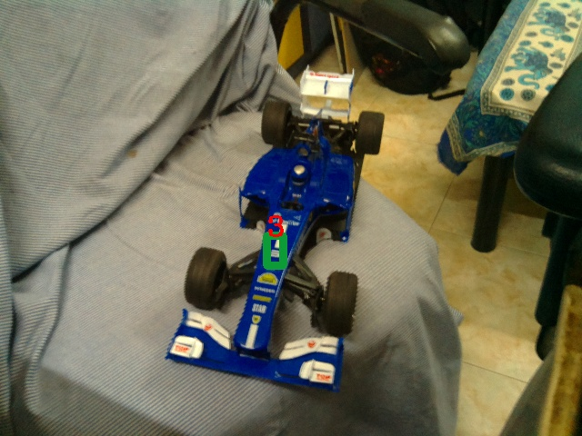

# F1-Car-Detection-Project
Prototype system to automatically capture times of F1 cars in races using computer vision. The results are visible to everyone over the internet.

## What all I used to make the project:
YOLO, darknet on Windows: https://github.com/AlexeyAB/darknet  
Microsoft Visual Studio 2015  
CUDA  
Anaconda-Python: tensorflow-gpu, Keras, Numpy  
HTML   
PHP  
MySQL  
Apache Tomcat Webserver  
Raspberry Pi with Raspbian  
A camera for the RPi  
An IR sensor for the RPi  

## The Project:
This project aims to implement some of the technologies in the field of image processing to automatically bring live updates from a race track to fans. There will be a low power device deployed on the race track which will capture the images of cars crossing the finish line and process the image. The device will correctly identify the object (the car) and detect the position of the Number on the car. That number will be recognised by a different model. It will then return the car number and the time the car crossed the finish line to a central server. The central server will display these values to everyone accessing it over the internet. The device deployed at the track needs to be connected to the server by only a low bandwidth connection as it is not streaming all the images to the central server, rather just sending inferences over the connection. 
The future applications of such a project can be at busy intersections and commuters can access real time data of their route over the internet. It can also help automatically identify rule breakers. 

## Keywords:
Machine Learning, Edge Computing, Image Processing, Object Detection, Text recognition.

## Models and Weights:
https://drive.google.com/open?id=1NAcTBC5KFNOIMBlMqn7PUmO6i4hn_q0u
Go to this drive and download all the files. Place them in a folder custom-2 in the repository. (You can change the name, I had used the named custom-2 for YOLO model as it was custom model number 2.

## Instructions for getting it running on your Raspberry Pi:
Download this repository and place it on your raspberry pi. Paste the custom-2 folder with the weights from the drive in this repo.
The folder structure should be:  
F1-Car-Detection-Project  
|  
---> custom-2  

You will also have to set up your apache webserver on your raspberry pi.
Host the website on the raspberry pi so that it can be served as soon as the processing is competed.
Run the F1Proj.py file to begin the process. 
place all the php files in the /var/www/html folder in your raspberry pi.
when the F1Proj.py has finished loading all the models, it goes into the ready state; when it gets input from the IR sensor, it will capture an image and begin the process.
Open the raceUpdates.php file on your browser (can be any browser connected to the same network; I had turned on my mobile hotspot, so if another device connects to the hotspot, that device can access the data. It can be server over the internet as well. If the F1 stadium offers free WiFi, this data can be transferred without internet.) 
When you open the raceUpdates.php on your browser, you will see a list of race lap times.

## Youtube video demonstrating the working project:
https://www.youtube.com/watch?v=W42iA6Xadu0

## Some Issues I faced while making this:
1: Darkflow on python was not working with the latest tensorflow build.  
https://stackoverflow.com/questions/55196713/yolo-darkflow-error-tensorflow-python-framework-errors-impl-invalidargumenterro?noredirect=1#comment97254787_55196713  
I uninstalled tensorflow 1.14 and installed tensorflow 1.11 which solved the problem for me.

2: This is a stupid mistake I made, but when trying to build the darkflow on windows, I did not have the correct opencv version. AlexeyAB mentioned in his guide to get darkflow working that openCV 3.4 will not work. Make sure you are using an older one if that hasn't been fixed.

## Contact me:
I know I haven't made a complete explaination of the project over here due to time contraints on me. If you have any doubt, please ask and I would appreciate it if you want to add to the readme.
My College email address:
kunal.kolhe@stonybrook.edu
